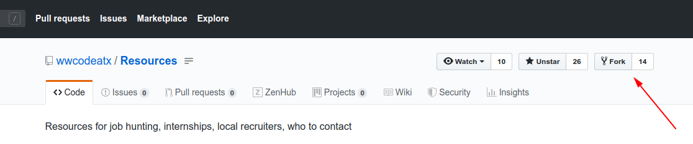
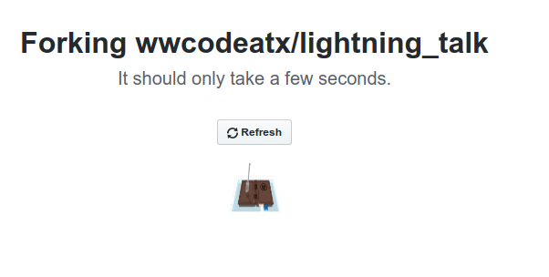
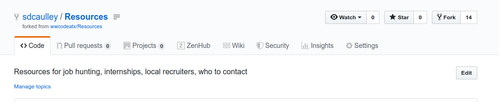
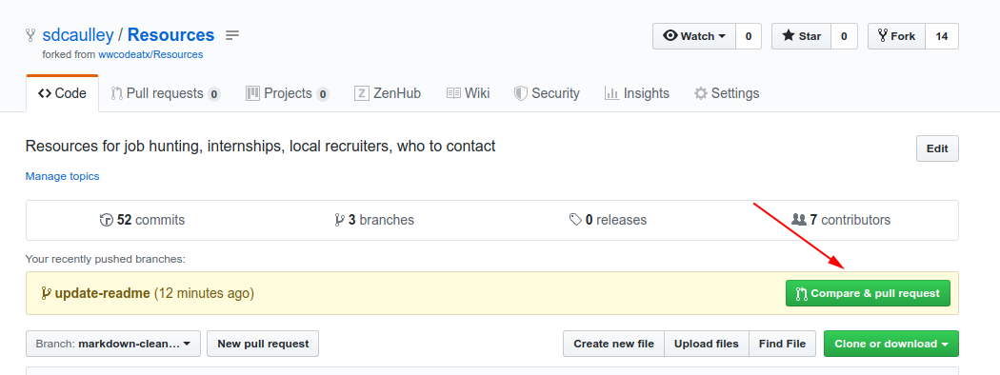

HOW TO MAKE A PULL REQUEST
==========================

So, you have found this wonderful repository and you want to make a contribution.  The best way to do that is with a pull request.  Don't know how to do that?  Don't worry, this document will walk you through the process.

### Forking the repository
Start by forking this repository.  This creates a snapshot of the master branch of this repository in your personal account, allowing you the ability to work with the code without inadvertently affecting the original repository.

To fork the repository:
* Click on the 'fork' button.

* Next choose the account you want the fork to be cloned to. 
  (You may have less choices then I do. :wink:).

This takes you to a wonderful hold screen while the forking takes place.

And now you have a copy in your repository.

### Prepare for Work
Now you have a copy of the original organizational repository.  Clone it to your computer as you normally would.  

Before going any further though, we need to make sure our fork can get updates from the original repository.  This requires adding an upstream to the forks remote configuration.  GitHub has an easy to use tutorial on how to do this [here](https://help.github.com/en/articles/configuring-a-remote-for-a-fork).  Now we can get updates from the original repository as needed.

### Create a Features branch
It is always a good idea to create a branch off master to do your work in.  A good practice is to name this branch after the feature or issue you are working on.  Do your work on this branch - making commits as you go along.

### Create a Pull Request
Once you are satisfied with your work, you can create a pull request against the original repository.  Github very handily does this for you when you push your updated code to your feature branch.

