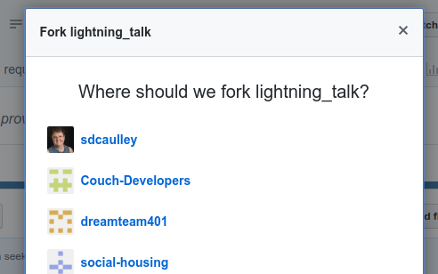
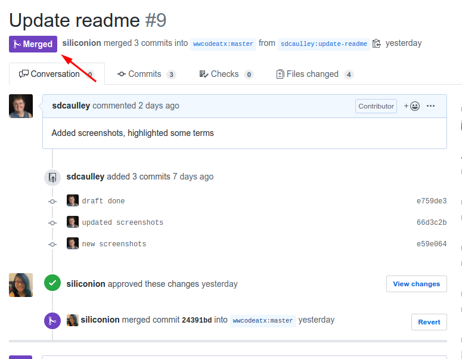

HOW TO MAKE A PULL REQUEST
==========================

So, you have found this wonderful repository and you want to make a contribution.  The best way to do that is with a pull request.  Don't know how to do that?  Don't worry, this document will walk you through the process.

### Forking the repository
Start by **forking** this repository.  From the official [GitHub Guide](https://guides.github.com/activities/forking/) on **forking**:

> Creating a “fork” is producing a personal copy of someone else’s project. Forks act as a sort of bridge between the original repository and your personal copy. You can submit Pull Requests to help make other people’s projects better by offering your changes up to the original project. Forking is at the core of social coding at GitHub.

To fork the repository:
* Click on the **fork** button.

* Next choose the account where you want the **fork** to be cloned. 
  (You may have less choices then I do. :wink:).

* This takes you to a wonderful hold screen while the forking takes place.

* And now you have a copy in your repository.

### Prepare for work
Now you have a copy of the original organizational repository.  **Clone** it to your computer as you normally would.  

Before going any further though, you need to make sure your **fork** can get updates from the original repository.  This requires adding an **upstream to the fork's remote** configuration.  GitHub has an easy to use tutorial on how to do this [here](https://help.github.com/en/articles/configuring-a-remote-for-a-fork).  Now you can get updates from the original repository as needed.

### Create a features Branch
It is always a good idea to create a branch off the **master branch** to do your work.  A good practice is to name this **branch** after the feature or issue you are working on.  Do your work on this **branch** - making commits as you go along.

### Create a Pull Request
Once you are satisfied with your work and you want to integrate it into the original project, you can create a **pull request** against the original repository.  The purpose of the **pull request** is to make your code available to the developers working on the original repository and offer for it to be **merged** with the original code.

* GitHub very handily offers to do this for you when you push your updated code to your feature branch.

* Clicking the button opens a form on the original repository page.  You can add an optional message about what is in your **pull request**.  Once you are done, click the "create pull request" button.

* On this particular repository, an admin needs to review the **pull request** and **merge** it for you.

* And you are **merged**.  **Pull request** success!

